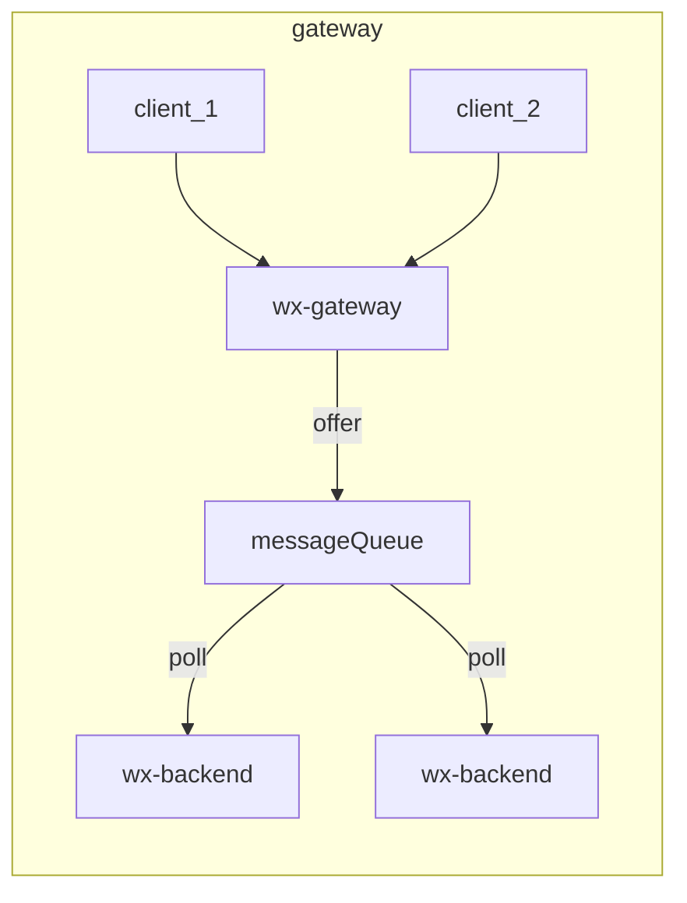

api-gateway
====

### Dependency

- hpeng526/wx-backend
- hpeng526/wx

```mermaid

graph BT;

subgraph gateway

client_1-->A
client_2-->A
A[wx-gateway]-->|offer|B[messageQueue]
B-->|poll|C1[wx-backend]
B-->|poll|C2[wx-backend]

end

```
